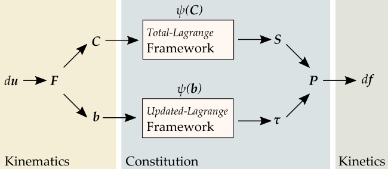

Frameworks
~~~~~~~~~~

The (topologic) deformation of a solid body is given by a displacement field. The deformation gradient, the right and left Cauchy-Green deformation tensors as well as related strain tensors are displacement- or deformation-derived kinematic quantities. The kinetics, i.e. the force vector acting on a solid body, is evaluated by the stress tensor and the appropriate area normal vector. The constitutive material model is formulated within a framework which links work-conjugate quantities of stress and strain. The stress tensor of the framework has to be transformed to be consistent with the force and area normal vectors. Here, the first Piola-Kirchhoff stress tensor is used to evaluate the force vector in the deformed configuration by the area normal vector of the undeformed configuration.

Generalized *Total-Lagrange* :mod:`Frameworks <.frameworks>` for isotropic hyperelastic material formulations based on the invariants of the right Cauchy-Green deformation tensor and the principal stretches enable a clean coding of isotropic material formulations.

.. automodule:: hyperelastic.frameworks
   :members:
   :undoc-members:
   :inherited-members:
