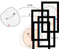

Spaces
~~~~~~

:mod:`Spaces <.spaces>` are full or partial deformations on which a given material formulation may be projected to, e.g. to the distortional (part of the deformation) space.

.. automodule:: hyperelastic.spaces
   :members:
   :undoc-members:
   :inherited-members: