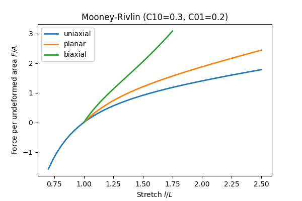

Getting Started
---------------

:mod:`Spaces <.spaces>` are full or partial deformations on which a given material formulation should be projected to, e.g. to the distortional (part of the deformation) space. Generalized *Total-Lagrange* :mod:`Frameworks <.frameworks>` for isotropic hyperelastic material formulations based on the invariants of the right Cauchy-Green deformation tensor and the principal stretches enable a clean coding of isotropic material formulations.

The :mod:`Math <.math>`-module provides helpers in reduced vector `Voigt <https://en.wikipedia.org/wiki/Voigt_notation>`_ storage for symmetric three-dimensional second-order tensors along with a matrix storage for (at least minor) symmetric three-dimensional fourth-order tensors.

Material :mod:`model formulations <.models>` have to be created as classes with methods for the evaluation of the `gradient` (stress) and the `hessian` (elasticity) of the strain energy function. It depends on the :mod:`Framework <.frameworks>` which derivatives have to be defined, e.g. the derivatives w.r.t. the invariants of the right Cauchy-Green deformation tensor or w.r.t. the principal stretches. An instance of a :mod:`Framework <.frameworks>` has to be *finalized* by the application on a :mod:`Space <.spaces>`.

First, let's import hyperelastic.

..  code-block:: python

    import hyperelastic

Available material formulations
~~~~~~~~~~~~~~~~~~~~~~~~~~~~~~~

+-----------------------------------------------------------------------------+----------------------------------------------+------------------------------------------------+
| Model Formulation                                                           | Framework                                    | Parameters                                     |
+=============================================================================+==============================================+================================================+
| :class:`Third Order Deformation <.models.invariants.ThirdOrderDeformation>` | :class:`Invariants <.frameworks.Invariants>` | :math:`C_{10}, C_{01}, C_{11}, C_{20}, C_{30}` |
+-----------------------------------------------------------------------------+----------------------------------------------+------------------------------------------------+
| :class:`Ogden <.models.stretches.Ogden>`                                    | :class:`Stretches <.frameworks.Stretches>`   | :math:`\mu, \alpha`                            |
+-----------------------------------------------------------------------------+----------------------------------------------+------------------------------------------------+

An instance of one of these models is then embedded into the corresponding :mod:`Framework <.frameworks>`, which is further applied onto a :mod:`Space <.spaces>`.

..  code-block:: python

    model = hyperelastic.models.invariants.ThirdOrderDeformation(C10=0.5)
    framework = hyperelastic.InvariantsFramework(model)
    umat = hyperelastic.DistortionalSpace(framework)

.. note::
   Instead of using the implemented models, define your own material model formulation with manual, automatic or symbolic differentiation with the help of your favourite package, e.g. `PyTorch <https://pytorch.org/>`_, `JAX <https://jax.readthedocs.io/en/latest/>`_, `Tensorflow <https://www.tensorflow.org/>`_, `TensorTRAX <https://github.com/adtzlr/tensortrax>`_, `SymPy <https://www.sympy.org/en/index.html>`_, etc.

Invariant-based material formulations
~~~~~~~~~~~~~~~~~~~~~~~~~~~~~~~~~~~~~
A minimal template for an invariant-based material formulation applied on the distortional space:

..  code-block:: python

    class MyInvariantsModel:
        def gradient(self, I1, I2, I3, statevars):
            """The gradient as the partial derivative of the strain energy function w.r.t.
            the invariants of the right Cauchy-Green deformation tensor."""

            # user code
            dWdI1 = None
            dWdI2 = None
            dWdI3 = None

            return dWdI1, dWdI2, dWdI3, statevars

        def hessian(self, I1, I2, I3, statevars_old):
            """The hessian as the second partial derivatives of the strain energy function
            w.r.t. the invariants of the right Cauchy-Green deformation tensor."""

            # user code
            d2WdI1I1 = None
            d2WdI2I2 = None
            d2WdI3I3 = None
            d2WdI1I2 = None
            d2WdI2I3 = None
            d2WdI1I3 = None

            return d2WdI1I1, d2WdI2I2, d2WdI3I3, d2WdI1I2, d2WdI2I3, d2WdI1I3

    model = MyInvariantsModel()
    framework = hyperelastic.InvariantsFramework(model)
    umat = hyperelastic.DistortionalSpace(framework)

Principal stretch-based material formulations
~~~~~~~~~~~~~~~~~~~~~~~~~~~~~~~~~~~~~~~~~~~~~
A minimal template for a principal stretch-based material formulation applied on the distortional space:

..  code-block:: python

    class MyStretchesModel:
        def gradient(self, λ, statevars):
            """The gradient as the partial derivative of the strain energy function w.r.t.
            the principal stretches."""

            # user code
            dWdλ1, dWdλ2, dWdλ3 = 0 * λ

            return [dWdλ1, dWdλ2, dWdλ3], statevars

        def hessian(self, λ, statevars_old):
            """The hessian as the second partial derivatives of the strain energy function
            w.r.t. the principal stretches."""

            # user code
            d2Wdλ1dλ1 = None
            d2Wdλ2dλ2 = None
            d2Wdλ3dλ3 = None
            d2Wdλ1dλ2 = None
            d2Wdλ2dλ3 = None
            d2Wdλ1dλ3 = None

            return d2Wdλ1dλ1, d2Wdλ2dλ2, d2Wdλ3dλ3, d2Wdλ1dλ2, d2Wdλ2dλ3, d2Wdλ1dλ3

    model = MyStretchesModel()
    framework = hyperelastic.StretchesFramework(model)
    umat = hyperelastic.DistortionalSpace(framework)

Lab
~~~

In the :mod:`Lab <.lab>`, :class:`Simulations <.lab.Simulation>` on homogeneous load cases provide a visualization of the material response behaviour.

..  code-block:: python

    import numpy as np
    import hyperelastic

    stretch = np.linspace(0.7, 2.5, 181)
    parameters = {"C10": 0.3, "C01": 0.2}

    def material(C10, C01):
        tod = hyperelastic.models.invariants.ThirdOrderDeformation(C10=C10, C01=C01)
        framework = hyperelastic.InvariantsFramework(tod)
        return hyperelastic.DeformationSpace(framework)
    
    ux = hyperelastic.lab.Simulation(
        loadcase=hyperelastic.lab.Uniaxial(label="uniaxial"),
        stretch=np.linspace(0.7, 2.5),
        material=material,
        labels=parameters.keys(),
        parameters=parameters.values(),
    )

    ps = hyperelastic.lab.Simulation(
        loadcase=hyperelastic.lab.Planar(label="planar"),
        stretch=np.linspace(1.0, 2.5),
        material=material,
        labels=parameters.keys(),
        parameters=parameters.values(),
    )

    bx = hyperelastic.lab.Simulation(
        loadcase=hyperelastic.lab.Biaxial(label="biaxial"),
        stretch=np.linspace(1.0, 1.75),
        material=material,
        labels=parameters.keys(),
        parameters=parameters.values(),
    )

    fig, ax = ux.plot_stress_stretch(lw=2)
    fig, ax = ps.plot_stress_stretch(ax=ax, lw=2)
    fig, ax = bx.plot_stress_stretch(ax=ax, lw=2)

    ax.legend()
    ax.set_title(rf"Mooney-Rivlin (C10={parameters['C10']}, C01={parameters['C01']})")

